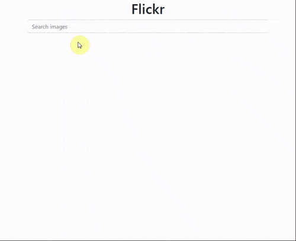

# Angular app that uses Flickr API to search for photos

This is an Angular project showcasing a simple photo lookup using a public Flickr API.




More information about Flickr API:

https://www.flickr.com/services/api/

## Installation

In the project folder, type:
```
npm install
```

You need to create a Flickr account and get your API key.
That key has to be set inside environment/environment.ts file.

## Usage

In the project folder, type:
```
ng serve
```

Then open your browser and go to:
http://localhost:4200/
